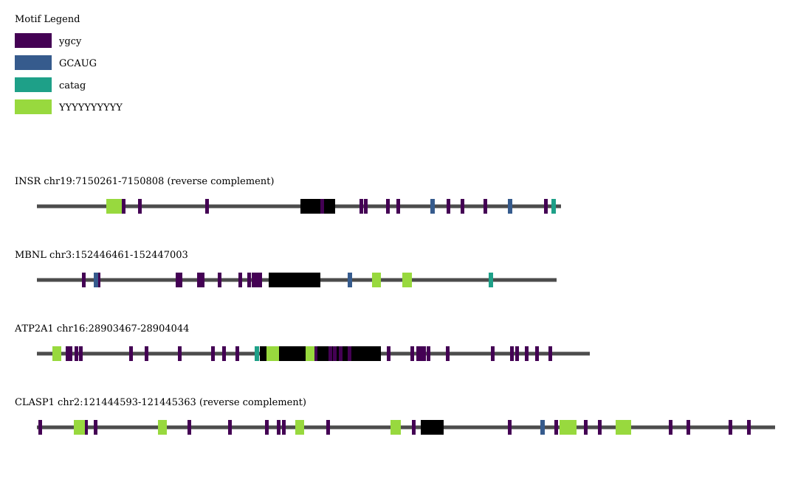

# Motif-Mark
A sequence motif is a short nucleotide pattern that is widespread, conserved across organisms, and often has (or is confirmed to have) biological significance. Commonly they are protein binding sites and involved in gene expression regulation. Locating motifs on DNA sequences is complicated by the fact that many can have more than one nucleotide at certain positions, and motifs may be overlapping.

This script helps visualize **up to eight (8)** motifs present in genetic sequence files, to provide insight into possible sites of gene regulation. All sequences and motifs are to scale with themselves and with each other.

## Quick Start
Inputs:
1. A properly formatted FASTA file. This should be a "soft-masked" file, with exons being in uppercase and introns or repeating sequences in lower case. An example may be viewed [here](test.fa "Example soft-masked FASTA file").

2. A list of motifs (up to 8) to search for. Each motif should be on its own line. An example of a motif list may be viewed [here](Fig_1_motifs.txt "Example Motif File").

3. To run Motif-Mark on default settings: 
`./motif-mark.py -f /path/to/FASTAFILE.fa -m /path/to/MOTIFFILE.txt`

Motif-mark will save the image output in the same directory as the original FASTA file.

Default settings produce a vector-based (SVG) image (FASTAFILE_motifs.svg) on a light background that uses a color palette based on viridis from MatPlotLib.

Required modules:
* [Pycairo](https://pypi.org/project/pycairo/)
* re (standard library)
* argparse (standard library)

Sample output:

## Options

### Output
The default output filetype is an SVG file. setting the `-o` flag will allow the user to specify the output format they want.

Available formats and commands:
* SVG (default)
* PDF `-o pdf`
* PNG `-o png`

### Custom Colors and Palettes
Motif-mark offers the ability to hand-pick colors or from a pre-set palette. The custom colors available are shown below in Figure 1. Colors and palettes are generated from MatPlotLib's named color library and select colormaps, shown in Figure 2. If the figure will be printed in black and white or monochrome, it is recommended that you use viridis or plasma as they provide distinction between motifs using darkness/lightness as well as hue.

<b>Available palettes:</b>
* viridis (color vision-deficient safe/perceptually uniform)
* plasma (color vision-deficient safe/perceptually uniform)
* jet
* gist_rainbow
* rainbow
* set1
* cvd_safe (color vision-deficient safe)

Sample code using four custom colors: `./motif-mark.py -f /path/to/FASTAFILE.fa -m /path/to/MOTIFFILE.txt -c firebrick orangered forestgreen midnightblue`

Sample code using palettes: `./motif-mark.py -f /path/to/FASTAFILE.fa -m /path/to/MOTIFFILE.txt -c viridis`

 

 
